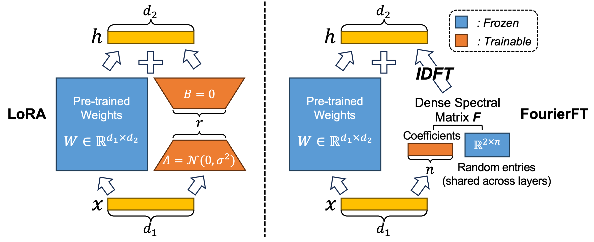

# Parameter-Efficient Fine-Tuning with Discrete Fourier Transform


The official implementation of "Parameter-Efficient Fine-Tuning with Discrete Fourier Transform" now lives in [the Hugging Face PEFT library](https://github.com/huggingface/peft).

For the usage guide, see [this page](https://huggingface.co/docs/peft/main/en/package_reference/fourierft) to learn how to use FourierFT in PEFT.


## Citing our work
```
```bibtex
@inproceedings{DBLP:conf/icml/GaoWCLWC024,
  author       = {Ziqi Gao and Qichao Wang and Aochuan Chen and Zijing Liu and Bingzhe Wu and Liang Chen and Jia Li},
  title        = {Parameter-Efficient Fine-Tuning with Discrete Fourier Transform},
  booktitle    = {Forty-first International Conference on Machine Learning, {ICML} 2024,
                  Vienna, Austria, July 21-27, 2024},
  year         = {2024},
}
```